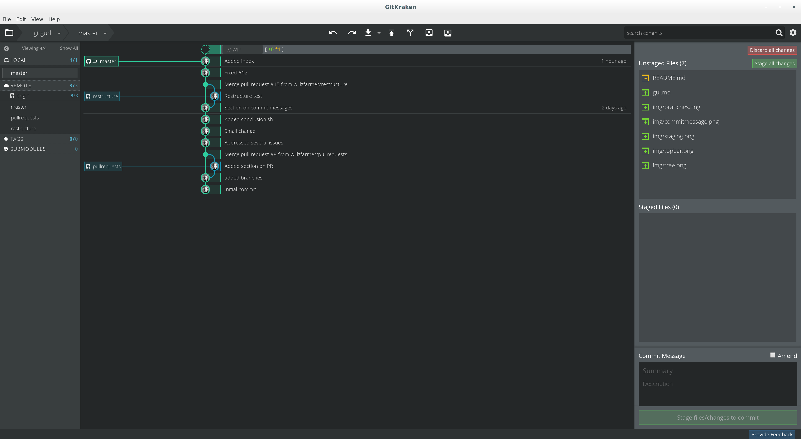
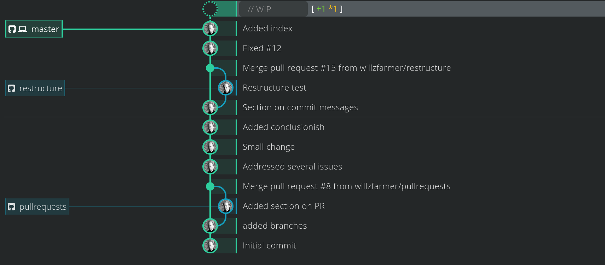
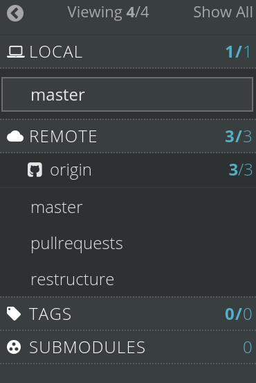

# Git Kraken

Git Kraken is a fairly new interface for git. [It can be downloaded
here](https://www.gitkraken.com).

It's super sleek and my definite recommendation for those not wanting to fiddle
around with the command line. Here's a picture of the interface.

Let's examine each part. The central focus of the tool is the tree view which
shows commits over time and the structure of any branches/merges/pull requests.
Each commit can be selected and you can see what files were edited, including
the exact edits themselves.

On the right you can see the staging area which shows files that have either
been staged, or are unstaged. In essence this shows what parts have changed
since your last commit.

On the bottom right you can edit the commit message for the current commit.

On the left you can see what branches you have, as well as tags and submodules.

And finally, on the top bar you have the essential commands which are (left to
right),

* Undo Commit
* Redo Previous Undo
* Pull Remote Changes
* Push Local Changes
* Create a New Branch
* Stash Changes
* Pop Stash

